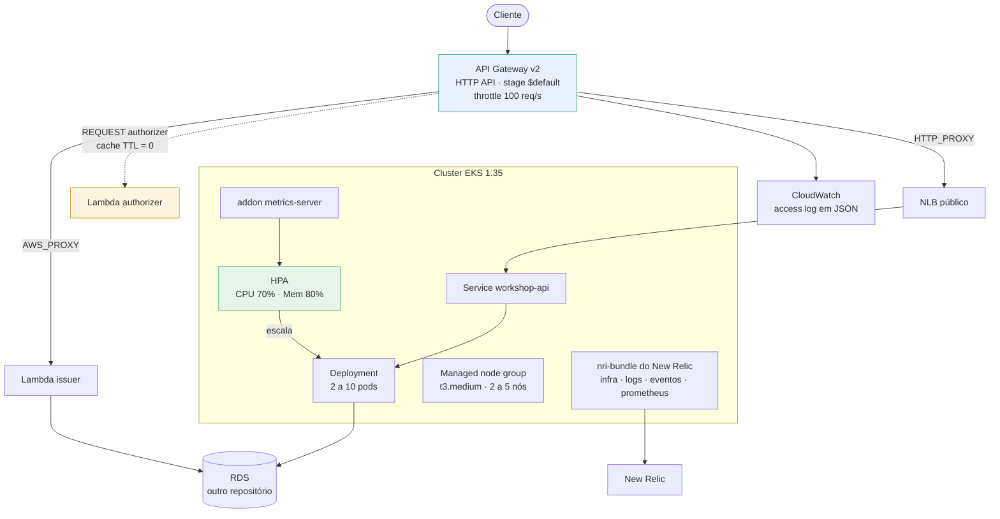
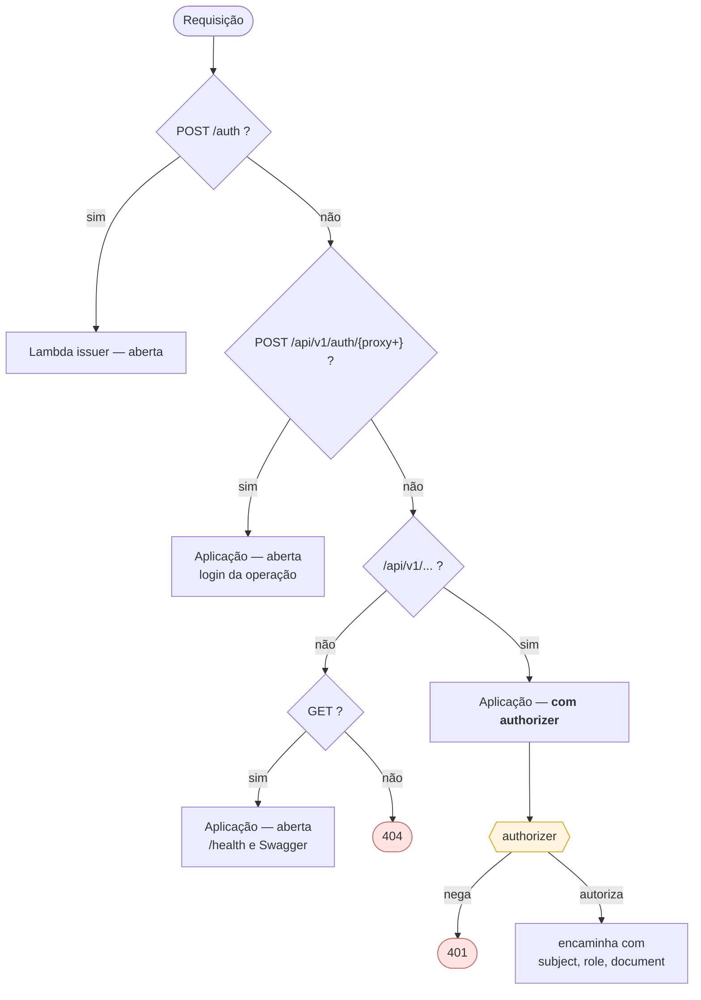
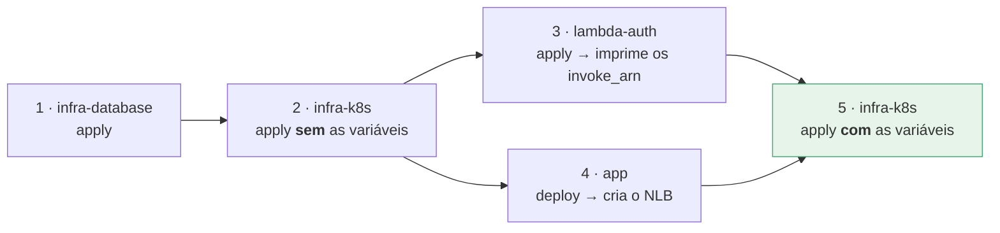
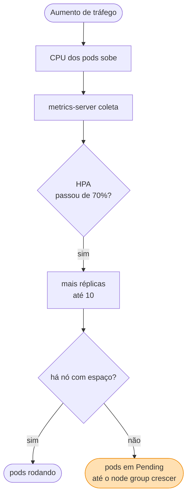

# postech-tc3-infra-k8s

Provisionamento do **cluster Kubernetes (Amazon EKS)** e do **API Gateway** do sistema de gestão de oficinas mecânicas.

Tech Challenge Fase 3 — FIAP Pós Tech SOAT.

## Propósito

Entrega a plataforma onde a aplicação roda: cluster EKS com node group escalável e o HTTP API Gateway que fica na frente dele. O banco vive em [`postech-tc3-infra-database`](https://github.com/Kc1t/postech-tc3-infra-database); a aplicação, em [`postech-tc3-app`](https://github.com/Kc1t/postech-tc3-app); o autorizador, em [`postech-tc3-lambda-auth`](https://github.com/Kc1t/postech-tc3-lambda-auth).

## Tecnologias

- Terraform >= 1.5
- AWS: EKS, API Gateway v2 (HTTP API), CloudWatch Logs
- Backend de state: S3
- CI/CD: GitHub Actions com OIDC

## Arquitetura



### Grafo de decisão do gateway



A rota **mais específica vence**. É por isso que `POST /api/v1/auth/{proxy+}` precisa ser declarada: sem ela, o login cairia na regra protegida e exigiria um token para obter um token.

## Estrutura

```
versions.tf              providers e backend
variables.tf             entradas
main.tf                  locals e lookup de subnets
eks.tf                   cluster + managed node group
addons.tf                addon metrics-server (pre-requisito do HPA)
api_gateway.tf           HTTP API, stage, rotas, integracoes e authorizer
helm/newrelic-values.yaml valores do nri-bundle
outputs.tf               endpoint do cluster, endpoint do gateway, rotas
envs/                    tfvars por ambiente
```

## Rotas do gateway

| Rota | Destino | Autenticacao |
|---|---|---|
| `POST /auth` | Lambda emissora | aberta — e onde o CPF vira JWT |
| `POST /api/v1/auth/{proxy+}` | aplicacao | aberta — login/registro/refresh do painel |
| `GET /{proxy+}` | aplicacao | aberta — `/health` e Swagger |
| `ANY /api/v1/{proxy+}` | aplicacao | **authorizer Lambda** |

A rota mais especifica vence, entao `ANY /api/v1/{proxy+}` protege tudo sob `/api/v1` exceto o grupo de auth declarado acima. As consultas de ordem de servico do cliente, que na Fase 2 eram publicas, passam a exigir o JWT emitido a partir do CPF.

O authorizer roda com TTL de cache zero: o veredito e recalculado a cada requisicao, para que a desativacao de um cliente tenha efeito imediato.

As tres variaveis `lambda_issuer_invoke_arn`, `lambda_authorizer_invoke_arn` e `app_backend_url` sao opcionais. Vazias, o gateway sobe sem as rotas correspondentes — o que permite aplicar a infraestrutura antes da Lambda e da aplicacao existirem.

### Ordem de aplicação entre repositórios

Essa opcionalidade existe para quebrar uma dependência circular: o gateway precisa da Lambda, a Lambda precisa do banco, e o gateway precisa do NLB que só nasce com o deploy da aplicação.



Os valores dos passos 3 e 4 são copiados à mão para `envs/*.tfvars` — os states são separados por repositório, então não há referência automática entre eles. O resumo do job do `lambda-auth` já imprime as quatro linhas prontas para colar.

## Exposicao da aplicacao

O `Service` da aplicacao e do tipo `LoadBalancer` e provisiona um NLB publico, que o gateway consome por integracao `HTTP_PROXY`. Isso mantem o NLB alcancavel diretamente, contornando o gateway.

A protecao nao depende disso: o middleware `Auth` da aplicacao valida o mesmo JWT HS256 que o authorizer valida. O gateway e a primeira camada, a aplicacao e a segunda. Fechar o NLB exigiria VPC Link com NLB interno, registrado como alternativa no ADR de comunicacao.

## Execução local

```bash
terraform init \
  -backend-config="bucket=<seu-bucket-de-state>" \
  -backend-config="key=k8s/staging.tfstate" \
  -backend-config="region=us-east-1"

terraform plan  -var-file=envs/staging.tfvars
terraform apply -var-file=envs/staging.tfvars

aws eks update-kubeconfig --region us-east-1 --name postech-tc3-staging
```

O `lambda_authorizer_invoke_arn` é opcional: sem ele o authorizer não é criado, o que permite subir o gateway antes da lambda existir.

## Deploy

| Evento | Ação |
|---|---|
| Pull Request | `fmt`, `validate`, `tfsec` e `plan` em staging |
| Push em `homolog` | `apply` em staging |
| Push em `main` | `apply` em produção |

Secrets necessários: `AWS_ROLE_ARN` e `TF_STATE_BUCKET`.

## Escalabilidade

São dois níveis independentes e complementares:



- **Nós:** managed node group entre `node_min` e `node_max`.
- **Pods:** HPA declarado nos manifests do `postech-tc3-app`, 2 a 10 réplicas por CPU e memória.
- O addon **metrics-server** é provisionado aqui. Sem ele o HPA fica em `<unknown>` e nunca escala — falha silenciosa, não erro.

Escalar pods só resolve enquanto houver capacidade de nó. No teto do node group, o HPA continua pedindo réplicas e elas ficam em `Pending`. Detalhamento no [ADR-0008](https://github.com/Kc1t/postech-tc3-app/blob/main/docs/adr/0008-hpa.md).

## Custo

| Item | US$/hora | US$/mês 24/7 |
|---|---|---|
| Control plane do EKS | 0,100 | 73,00 |
| 2× `t3.medium` | 0,083 | 60,74 |
| EBS 20 GiB × 2 | — | 3,20 |
| API Gateway HTTP | US$ 1,00 por milhão de requisições | ~0 |
| **Total** | **~0,19** | **~137** |

Este repositório concentra o custo do projeto. Duas medidas de contenção:

- **`terraform destroy` ao fim de cada sessão.** O control plane cobra por hora mesmo sem nenhum pod rodando.
- **Versão do cluster em suporte padrão.** A 1.31 estava em *extended support*, cobrada a US$ 0,60/hora — seis vezes mais. A 1.35 tem suporte padrão até 27/03/2027. Nunca deixar cair em extended.

## Observabilidade

Após o `apply`, o pipeline instala o `nri-bundle` do New Relic via Helm, com infraestrutura, eventos do Kubernetes, `kube-state-metrics`, coleta de logs e agente Prometheus.

Secret necessário: `NEW_RELIC_LICENSE_KEY`. Sem ele o passo é pulado e o `apply` segue normalmente.
